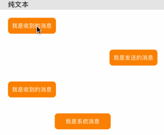
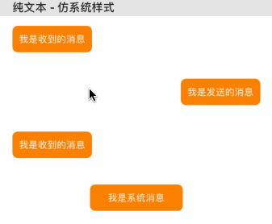
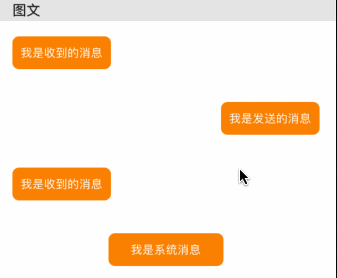
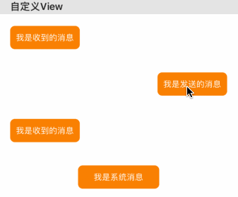
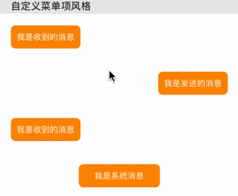

## XMMenuPopover


### Introduction

一个仿系统(`UIMenuController`)的自定义选择菜单项，实现了纯文本、图文、自定义View等展示样式，你也可以很方便的扩展实现自己的样式【例如微信、钉钉、QQ等聊天界面长按的样式】


### Installation

#### 一、Cocoapods
	
*  在Podfile文件中添加
	
	```
	target 'YouProject' do
	  pod 'XMMenuPopover'
	end
	```
* 命令行执行

	*  `pod repo update master`
	*  `pod install`

#### 二、复制`XMMenuPopover `文件夹至您的项目中即可

### Example

#### 1. 自定义纯文本样式 `XMMenuStyleDefault`



#### 2. 仿系统纯文本样式 `XMMenuStyleSystem`



#### 3. 图文样式 `XMMenuStyleImageText`



#### 4. 自定义View样式 `XMMenuStyleCustom`



#### 5. 自定义菜单项风格



***PS: 更多样式请查看demo***

### Usage

#### 代码
```OC
XMMenuPopover *menu = [XMMenuPopover sharedMenuPopover];
menu.style = XMMenuStyleSystem;
XMMenuItem *item1 = [[XMMenuItem alloc] initWithTitle:@"复制" actionHandler:^{
    NSLog(@"88");
}];
XMMenuItem *item2 = [[XMMenuItem alloc] initWithTitle:@"添加到收藏夹" target:self action:@selector(clickAction)];
XMMenuItem *item3 = [[XMMenuItem alloc] initWithTitle:@"发送给好友" target:self action:@selector(clickAction)];
menu.menuItems = @[item1,item2,item3];
[menu showMenuFromView:targetView rect:targetView.bounds animated:YES];
```
#### 展示效果


### Contribution

You are welcome to fork and submit pull requests.


### License

XMMenuPopover is open-sourced software licensed under the MIT license.

